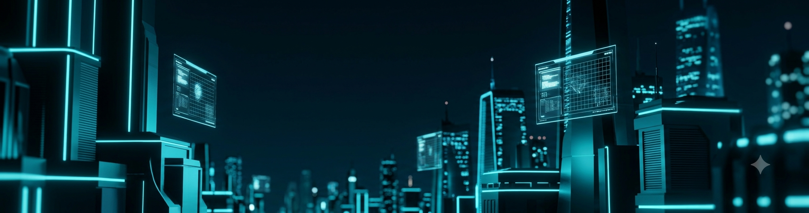

 

 

 

 

## `//` About

I build backend systems for AI pipelines — retrieval, diagnostics, and the infrastructure that makes LLMs useful in production rather than just impressive in a demo.

Last summer I worked on a generative AI pipeline at FourKites that automated commercial invoice extraction, going from manual process to production deployment. Since then I've built an EV fault-diagnosis platform combining vector search with a knowledge graph, a fine-tuned transformer for Hindi/Hinglish fake news detection, and a reinforcement learning agent for 3D navigation.

I care more about whether a system holds up under real constraints — memory limits, noisy data, ambiguous retrieval — than whether the demo looks good.

 

## `//` Experience

<table>
<tr>
<td>

**Software Engineer Intern** — FourKites
*Chennai, India · May 2025 – Jul 2025*

Built backend services for a generative AI pipeline that automated commercial invoice data extraction, using Python, FastAPI, LangChain, and AWS. Worked with senior AI engineers and PMs to onboard suppliers and ship feature enhancements. Contributed to RAG pipeline optimization — embeddings, transformer inference, prompt validation — and restructured AWS S3 storage and Pipedream workflows for improved reliability. Shipped to production.

</td>
</tr>
</table>

 

## `//` Projects

<table>
<tr>
<td width="50%" valign="top">

### ⟡ EV Powertrain Fault Intelligence
AI-powered diagnostic platform combining vector search (PostgreSQL/pgvector) with knowledge graph queries (Neo4j) for EV fault diagnosis. Modular backend with separate services for retrieval, diagnosis, and automated report generation.

**[→ Repository](https://github.com/bharadwajpp/Ev-agentic-ai)**

</td>
<td width="50%" valign="top">

### ⟡ Multilingual Fact-Checking System
Fine-tuned MuRIL on 3,277 Hindi/Hinglish news articles for fake news classification (76.4% accuracy). Automated pipeline using LLM-based translation, FAISS retrieval, and NLI — optimized for 8GB GPU inference.

**[→ Repository](https://github.com/bharadwajpp/Fact-check-ai)**

</td>
</tr>
<tr>
<td width="50%" valign="top">

### ⟡ Reinforcement Learning — 3D Navigation
Q-learning agent for navigation in a stochastic 3D Gridworld, using ε-greedy exploration. Outperformed baseline success rate; evaluated across multiple reward structures and transition dynamics.

**[→ Repository](https://github.com/bharadwajpp/3D_Gridworld_Reinforcement_Learning)**

</td>
<td width="50%" valign="top">

</td>
</tr>
</table>

 

## `//` Stack

 

 

## `//` System Stats

 

## `//` Contact

Open to internships and roles in backend engineering, applied ML, and AI infrastructure.

📫 **f20230603@pilani.bits-pilani.ac.in** · 📍 Pilani, Rajasthan, India

 

